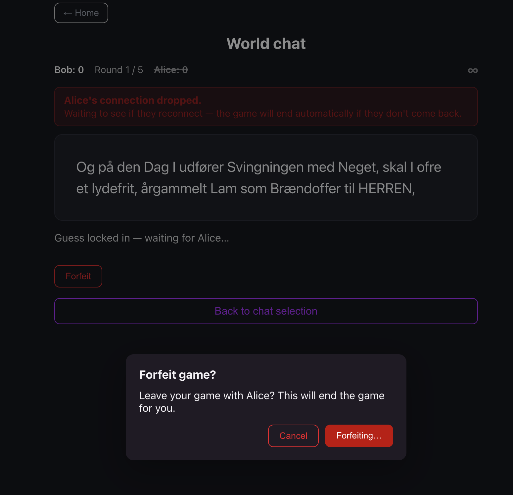

# Forfeiting can trap the player in the confirmation dialog

When the opponent's connection drops, the game stays running through the
reconnect grace period. If the remaining player forfeits during that
window — or at any point where the game has already been ended behind the
scenes — the confirmation dialog could stay on "Forfeiting…" forever, with
both buttons disabled, no error, and no way out. The player was trapped and
had to reload the page.

Two separate faults combined:

- The server silently did nothing when asked to forfeit a game it no longer
  had. The player was waiting for an answer that was never going to come.
- The dialog waited for that answer indefinitely, so anything that stopped
  it arriving — a dropped connection, or the above — left the dialog dead.

## Resolution

Fixed on both sides.

The server now always answers a forfeit. If there is no game left to end,
the caller is told so explicitly instead of being ignored.

The dialog no longer waits indefinitely. If nothing has happened within a
few seconds it re-enables the buttons and explains why, so the player can
retry or leave. Recovering is always safe: either the game is genuinely
over, in which case leaving works, or it is still running, in which case
retrying works. Staying stuck is never safe.

## Requirements

- A forfeit request must always produce a response, including when there is
  no game left to forfeit.
- The confirmation dialog must never remain disabled indefinitely.
- When a forfeit does not complete, the player must be told what happened
  and be able to either retry or leave.
